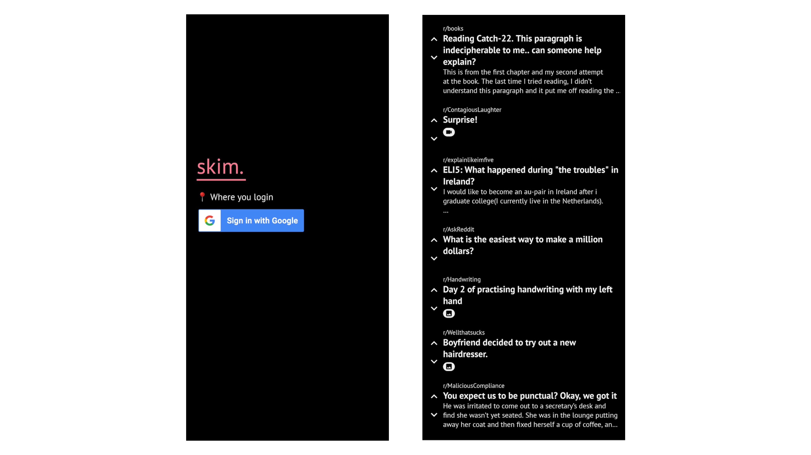

# skim.

One day, not very long ago, I deleted Instagram. I figured - the negatives _really_ beat out the positives. It worked well for a while, I wasn't compulsively checking Instagram dozens of times a day, & nothing was on fire.

Then, I noticed myself spending more & more time on Reddit. Now, Reddit was a bit of a head-scratcher. There were certainly a lot of benefits to being on Reddit, but still - everything in moderation.

I thought about it for a bit, & hypothesized that the Reddit Android App, like most social apps, was too good at reducing friction. Once I started scrolling, I probably wasn't going to stop scrolling anytime soon.

So - in typical Sheline Fashion, I thought, why not build a Reddit client that's best suited to what I'm looking for? Also, doesn't hurt to not have to scroll past those annoying annoying ads.

All this to say - this is the home of __skim__, Sheline's very own Reddit reader. It's name reflects what I hope for it to become - a tool to facilitate the _"act of reading something quickly or superficially"_, or, a solution that when compared to the official Reddit apps, prompts the comparison of whole milk against _skim_ milk.

### skim In The Wild (or, screenshots)
As skim is now, it has two main pages - the login page, where you ..login. & the home page, where you can browse (infinitely) your Reddit homepage. I'm able to upvote/ downvote posts, read basic info like the post title, some of its text, & if the post contains some media.

I'm planning for just one more page in skim - the individual thread page, where I'll be able to view the post in full. This means being able to read the full text of the post, viewing any attached media, as well as reading the comments below each post.